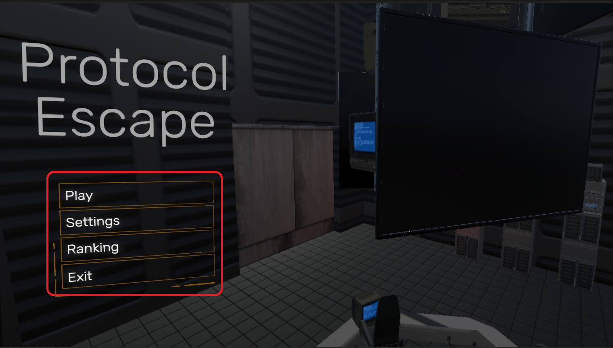
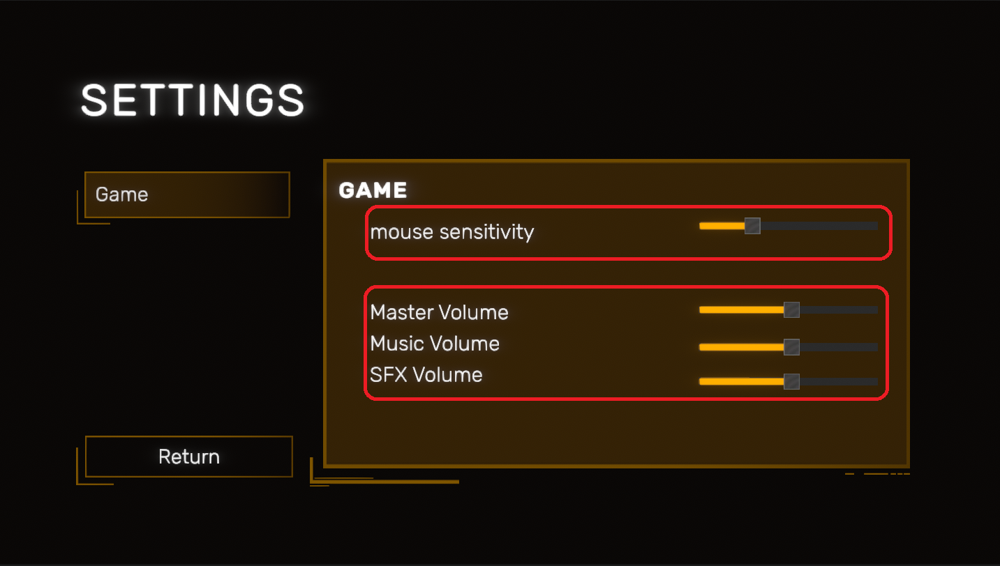
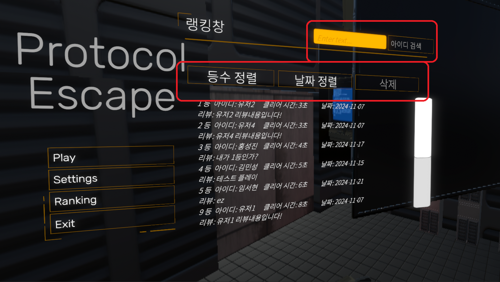
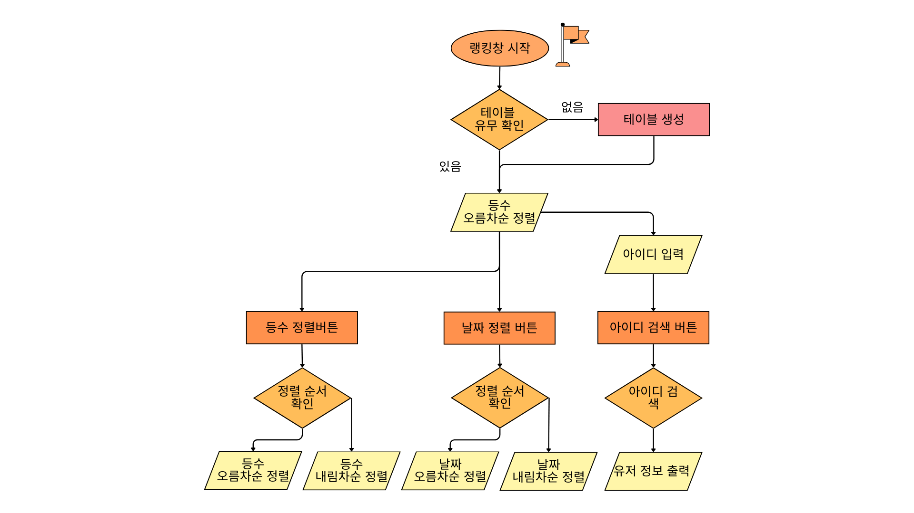
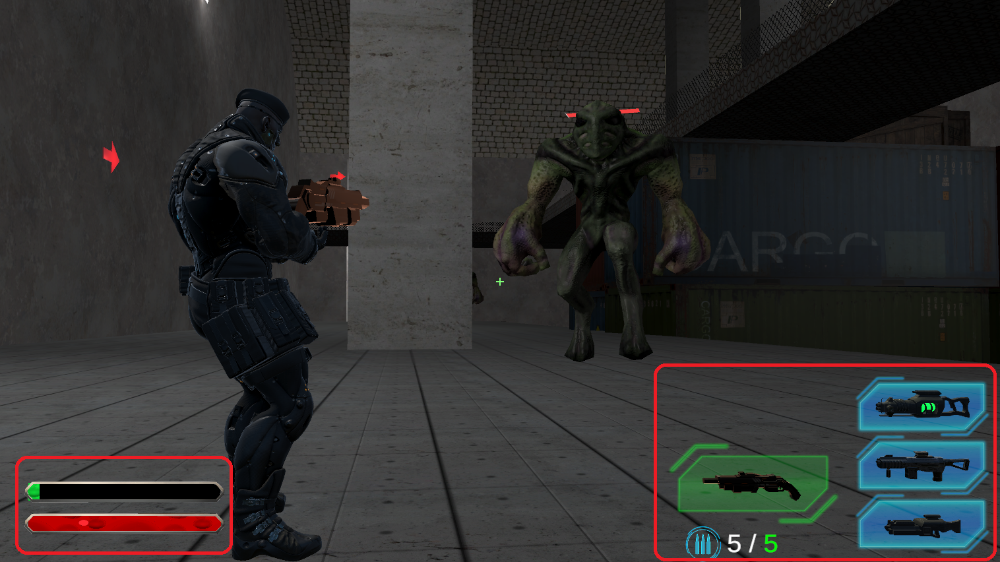
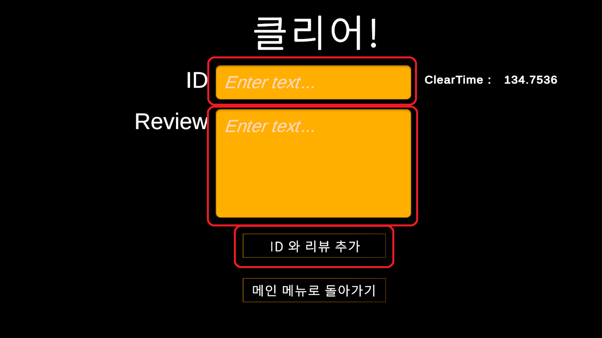
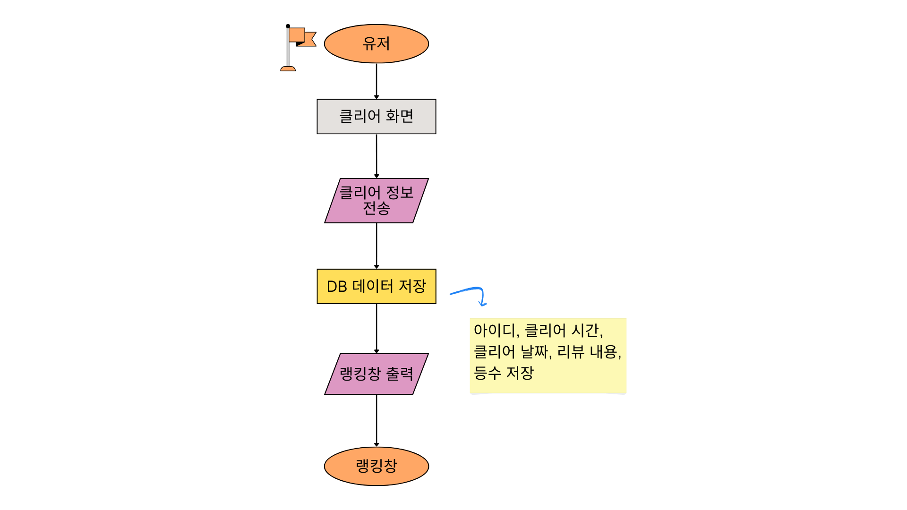

# unity-term-project
텀프로젝트 조별과제 게임 포토폴리오

# Protocol Escape

### 3인칭 기반 1인 슈팅 어드벤처 게임

---

## 프로젝트 개요

**Protocol Escape**는 속도감 있는 3인칭 슈팅 어드벤처 게임으로, 유저 간 클리어 타임 경쟁과 다양한 무기, 복잡한 맵 탐험을 특징으로 합니다. 본 게임은 Unity 엔진을 활용해 개발되었으며, 단순한 조작법과 전략적인 전투 시스템을 제공합니다.

### 주요 특징
- **간단한 조작**: 10개 이하의 버튼으로 게임 진행.
- **전략적인 전투**: 다양한 무기와 스테이지 설계.
- **유저 경쟁 유도**: 클리어 타임 기반 랭킹 시스템.

### 프로젝트 목표
- 속도감 있는 이동과 3인칭 시점 구현.
- 4개의 스테이지와 보스전을 포함한 대규모 맵 제작.
- 다양한 무기(권총, 샷건, 라이플, 플라즈마건) 개발.
- 몰입감을 높이는 사운드와 UI 디자인.
- 클리어 데이터를 활용한 랭킹 시스템 구현.

---

## 프로젝트 화면

### 메인 화면
게임의 시작 및 설정, 랭킹, 종료 버튼 제공.

<!-- 메인화면 이미지 삽입 -->

<메인화면 이미지>

메인 화면은 게임을 실행할 때 가장 먼저 표시되는 화면으로, 게임의 시작과 종료를 
담당합니다.

 1. 시작 버튼: 게임을 시작하여 인게임 화면으로 진입하는 버튼입니다.
 2. 설정 버튼: 마우스 감도, 음량 등을 설정할 수 있는 설정 창으로 이동하는 버튼입니다.
 3. 랭킹 버튼: 게임을 클리어한 유저들의 클리어 정보를 확인할 수 있는 순위 창으로 진입하
는 버튼입니다.
 4. 종료 버튼: 프로그램을 종료하는 버튼입니다.

---

### 설정 창
- 마우스 감도 및 소리 조절 기능 제공.

<!-- 설정창 이미지 삽입 -->

<설정창 이미지>

설정 창은 메인 화면에서 설정 버튼을 클릭하면 이동하는 화면으로, 유저는 마우스 감도와 음
량을 조절할 수 있습니다. 설정된 값은 프로그램 종료 후에도 내부적으로 저장되어, 다음에 
프로그램을 실행할 때 자동으로 불러옵니다.

 1. 마우스 감도 조절 스크롤: 인게임에서 마우스 감도를 조절할 수 있는 스크롤입니다.
 2. 소리 조절 스크롤: 메인 오디오, 배경 음악, 효과음을 각각 오디오 믹서 기능을 통해 개별
적으로 음량을 조절할 수 있는 스크롤입니다.

---

### 랭킹 창
- 클리어 타임 순위 및 검색 기능 제공.

<!-- 랭킹창 이미지 삽입 -->

<랭킹창 이미지>

랭킹창은 메인 화면에서 랭킹 버튼을 클릭하면 나타나는 화면으로, 클리어한 유저들의 정보를 
순위별로 보여줍니다. 또한, 데이터별 정렬 및 아이디 검색 기능을 제공합니다.

 1. 등수 정렬 버튼: 유저들의 순위를 기준으로 정렬하는 버튼입니다. 처음 클릭하면 오름차순
으로 정렬되며, 다시 클릭하면 내림차순으로 정렬됩니다.
 2. 날짜 정렬 버튼: 유저들이 게임을 클리어한 날짜를 기준으로 정렬하는 버튼입니다. 처음 클
릭하면 오름차순으로 정렬되고, 다시 클릭하면 내림차순으로 정렬됩니다.
 3. 삭제 버튼: 유저 데이터 테이블을 삭제하는 버튼입니다. 저장된 모든 기록을 삭제합니다.
 4. 아이디 검색 버튼: 버튼 왼쪽에 있는 TextInputField에 검색할 아이디를 입력한 후, 버튼
을 클릭하면 해당 아이디를 유저 데이터에서 검색하여 결과를 출력합니다.


<랭킹창 플로우차트>

---

### 인게임 화면
- 체력바와 쉴드바, 무기 인벤토리 및 탄약 정보 표시.

<!-- 인게임 화면 이미지 삽입 -->

<인게임 중 화면 이미지>

인게임 화면은 메인 화면에서 시작 버튼을 클릭하면 이동하는 화면으로, 게임의 핵심 
구간입니다. 유저는 이 화면에서 게임을 플레이하며 여러 기능을 사용하고, 게임 플레이 경험
을 제공합니다.

 1. 체력바와 쉴드바: 화면의 좌측 하단에 위치하며, 유저의 체력과 쉴드 수치를 표시하는 유저 
인터페이스입니다. 체력 수치가 0이 될 경우 게임오버 화면이 나타납니다.
 2. 무기 인벤토리: 유저가 획득한 무기들을 확인할 수 있는 유저 인터페이스입니다. 장비한 무
기와 소유하고 있는 무기를 따로 확인할 수 있습니다.
 3. 무기별 탄약 정보: 각 무기별로 남은 탄약 수를 보여주는 유저 인터페이스입니다.

---

### 클리어 화면
- 클리어 정보(ID, 리뷰)를 데이터베이스로 전송.

<!-- 클리어 화면 이미지 삽입 -->

<클리어 화면 이미지>

게임을 클리어할 시 나타나는 화면으로, 유저의 클리어 정보를 데이터베이스(DB)로 전송할 수 
있습니다.

 1. ID 및 리뷰 입력: 유저는 텍스트 필드를 통해 아이디와 리뷰를 작성할 수 있습니다.
 2. 클리어 정보 전송: 입력 후 ID 및 리뷰 추가 버튼을 클릭하면 아이디, 클리어 시간, 클리어 
날짜, 리뷰 내용이 DB로 전송됩니다.
 3. 메인화면으로 돌아가기: 클리어 정보를 전송한 후, 유저는 메인 화면으로 돌아갑니다.

---

## 데이터베이스 구조

| 데이터 항목  | 매개변수 타입 | 설명                     |
|--------------|---------------|--------------------------|
| 이름(id)      | PRIMARY KEY   | 각 유저 클리어 데이터의 식별 번호 |
| 플레이어 아이디 (player_id) | VARCHAR(20) | 유저의 닉네임             |
| 클리어 시간 (clear_time) | INT           | 초 단위로 저장된 클리어 타임 |
| 유저 리뷰 (review) | TEXT          | 유저 피드백 (최대 500자) |
| 클리어 날짜 (clear_date) | DATE          | 클리어 날짜와 시간         |
| 등수 (rank)   | INT           | 랭킹 시스템을 통한 유저 등수 |


<데이터 흐름도>

유저 데이터 처리 및 랭킹 기능
클리어 화면에서 유저가 입력한 데이터를 저장하고, 메인화면의 랭킹 버튼을 클릭하면 해당 
데이터가 불러와져 랭킹 창에 출력됩니다.
유저 데이터는 여러 가지 기능을 통해 활용됩니다. 랭킹창에서는 등수, 클리어 시간, 날짜 등
의 정보를 오름차순 및 내림차순으로 정렬할 수 있습니다. 또한, TextInputField에 아이디를 
입력하여 특정 유저의 아이디를 검색할 수 있는 기능도 제공합니다.

---

## 개발 과정

### 주요 일정
- **9월**: 시스템 분석 및 프로토타입 제작.
- **10월**: 기능 정의 및 주요 무기, 애니메이션 구현.
- **11월**: 최적화 및 버그 수정, 추가 기능 구현.
- **12월**: 최종 테스트 및 발표 준비.

### 협업 및 관리
- **GitHub Desktop**: 중앙 프로젝트 파일 관리 및 Push/Pull.
- **주간 회의**: 개발 방향성 확인 및 진행 상황 점검.
- **역할 분담**: 각 팀원의 전문성을 고려한 작업 분배.

---

## 개선사항 및 향후 계획

### 개선사항
- 애니메이션 품질 향상.
- 적 AI 행동 개선.
- 최적화 및 그래픽 품질 업그레이드.

### 향후 계획
- DLC(확장팩)를 통한 스테이지 확장.
- 새로운 몬스터와 무기 추가.
- PVP 멀티플레이 모드 개발.

---

## 팀원 구성

| 이름     | 역할                                |
|----------|-------------------------------------|
| 신윤섭   | 시스템 설계 및 DB 구현, 맵 디자인     |
| 김민성   | 플레이어 이동 및 무기 시스템 구현     |
| 홍성진   | UI 디자인, 사운드 시스템, 씬 전환 구현 |
| 임서현   | 기획, 문서 제작 및 테스트             |

---

## 실행 방법

1. 저장소를 클론합니다:
   ```bash
   git clone https://github.com/your-repo/protocol-escape.git
   ```
2. Unity로 프로젝트를 열어 빌드합니다.

---

## 라이선스
본 프로젝트는 MIT 라이선스를 따릅니다. 자세한 내용은 [LICENSE](LICENSE)를 참고하세요.

---

## 기여 방법
기여를 원하신다면, [CONTRIBUTING.md](CONTRIBUTING.md)를 참고하세요. 감사합니다!
